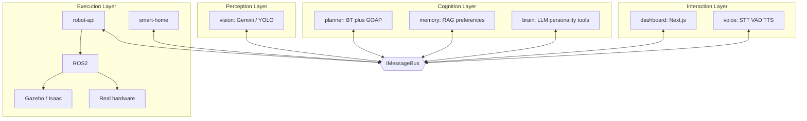

# Aria Architecture

Aria is a **distributed, plugin-based, local-first** software platform for a bilingual (Persian / English) humanoid home assistant. The robot is not one AI — it is a system of independent services behind stable ports.

## Principles

| Principle         | How we enforce it                                                       |
| ----------------- | ----------------------------------------------------------------------- |
| Modularity        | One service = one responsibility; packages map to future repos          |
| Replaceability    | Every model/hardware driver sits behind a port + plugin adapter         |
| Clean / Hexagonal | Domain logic depends inward on interfaces; adapters at edges            |
| SOLID + DI        | Constructor injection; composition roots only wire concretes            |
| Event-driven      | Services talk only via `IMessageBus` + the event catalog                |
| Local-first       | Inference on-device; cloud adapters optional and off by default         |
| Safety            | Brain never controls motors; `robot-api` + safety monitor own actuators |
| Offline           | Graceful degradation ladder down to safe stop                           |

## Topology



## Package map

| Path                                          | Role                                               |
| --------------------------------------------- | -------------------------------------------------- |
| [`packages/contracts`](../packages/contracts) | Ports, Zod schemas, event catalog (**sacred**)     |
| [`packages/core`](../packages/core)           | DI, bus adapters, config, logging, plugin registry |
| [`packages/tool-runtime`](../packages/tool-runtime) | Tool registry, executor, permissions, search orchestration |
| [`apps/brain`](../apps/brain)                 | LLM orchestration, personality, tool modules       |
| [`apps/voice`](../apps/voice)                 | Voice pipeline orchestration                       |
| [`apps/memory`](../apps/memory)               | ChromaDB / RAG / preferences                       |
| [`apps/vision`](../apps/vision)               | Perception + world model                           |
| [`apps/planner`](../apps/planner)             | Goals → action graphs                              |
| [`apps/smart-home`](../apps/smart-home)       | HA / MQTT / Matter skills                          |
| [`apps/robot-api`](../apps/robot-api)         | Skills, safety, ROS2 bridge                        |
| [`apps/dashboard`](../apps/dashboard)         | Operator UI                                        |
| [`sdk`](../sdk)                               | Public TS client                                   |
| [`sim`](../sim)                               | Gazebo / Isaac assets                              |
| [`sidecars`](../sidecars)                     | Python inference only                              |

**Dependency rule:** apps import `@aria/contracts` and `@aria/core` only — never sibling apps.

## Ports (replaceable surfaces)

Defined in `@aria/contracts`:

- `ILLMProvider` — Qwen / Ollama / OpenRouter / mock / cloud
- `ITool` / `IToolRegistry` / `IToolCatalog` / `IToolExecutor` — tool platform (ADR-0010)
- `ISearchProvider` / `ISearchOrchestrator` — swappable search backends (ADR-0010)
- `IWebSearchProvider` / `IWebPageFetcher` — legacy web look-up (ADR-0009; prefer search ports)
- `IPersonalityService` — bilingual personality / system prompts
- `IToolResultSynthesizer` — natural-language tool results (formatter registry)
- `IConversationPlanner` — soft plan + catalog-based tool-call validation
- `IPermissionStore` / `IPermissionGate` — tool permission grants
- `ISTTProvider` — Faster-Whisper / alternatives
- `ITTSProvider` — Piper / alternatives
- `IVisionProvider` — Gemini (default) or YOLO26+SAM2+VLM facade
- `IVisionSceneStore` — latest scene world model
- `IMemoryStore` — session store now; ChromaDB in Phase 3
- `IMessageBus` — in-process / NATS
- `IRobotSkill` — sim or real skill implementations

Swapping a model = new adapter + config change. Application services do not change.

**Adding a tool** = implement `ITool` + register in `registerBuiltinTools` — do not edit planner or prompts (ADR-0010).

## Pipelines

### Voice

Microphone → VAD → STT → `conversation.user_utterance` → Brain (+ Memory) → optional Goal → Planner → Tools → `conversation.assistant_delta`* → sentence TTS → Speaker → `conversation.assistant_reply`

\* Deltas stream as tokens arrive so the first sentence can speak before the
turn finishes (ADR-0014). The buffered `assistant_reply` still lands at the end
for history and the dashboard.

Phase 2 uses FFmpeg/FFplay for replaceable cross-platform audio I/O and a
loopback-only FastAPI sidecar for Silero VAD, Faster-Whisper, and Piper
(`POST /v1/synthesize/stream` for sentence PCM). The TypeScript state machine
remains continuously listening during transcription, agent work, and playback.
**Barge-in interrupts only while speaking (TTS)** and aborts the in-flight
audio HTTP stream. New speech during thinking is **queued** so the previous
answer is not cancelled (ADR-0012). Push-to-talk release calls
`finalizeCapture()` so utterances always flush.

The web interaction surface (`apps/dashboard`) connects through the voice web
gateway (`npm run voice:web`): text turns, browser PCM, and an optional vision
scene loop share the same process bus (ADR-0008). The camera stays idle until
the dashboard **Start video** control; frames then come from the vision sidecar
(OpenCV), not the browser tab. Chat tools capture that same sidecar camera
instead of a stub JPEG.

Audio is 16 kHz, mono, signed 16-bit little-endian PCM. Capture and VAD are
streaming; Faster-Whisper receives a complete VAD-segmented utterance. This is
intentional: Faster-Whisper is not presented as a true incremental decoder.

Every turn publishes `voice.turn_metrics`; the primary latency objective is
end-of-speech to playback start `< 2 s`. Persian and English are auto-detected;
TTS selects **Ganji** (`fa`) or **Lessac** (`en`).

### Brain (Phase 1 + Tool Platform)

`conversation.user_utterance` → `IConversationPlanner.assess` → `IMemoryStore.query` → `IPersonalityService` + catalog guidance → `ILLMProvider.generate` / `generateStream` → `validateToolCalls` → `IToolExecutor` → `IToolResultSynthesizer` → `conversation.assistant_delta`* → `conversation.assistant_reply` (+ turn metrics)

Providers: `mock` | `echo` | `ollama` | `openrouter` (see ADR-0005, ADR-0006, ADR-0007).
Per-user choices and API keys: [PROVIDERS.md](PROVIDERS.md), ADR-0011.

Optional search tools (`search_web`, `search_wikipedia`, `fetch_page`, …) register when `ARIA_WEB_ENABLED=true` (ADR-0009, ADR-0010). Catalog-driven discovery; planner does not hardcode tool names.

### Vision

Camera (OpenCV sidecar) → **frame-diff gate** → Gemini detect/describe (default) **or** YOLO26 on demand →
optional SAM2 (on demand) → `vision.scene_updated` → Planner / Brain

Default cloud CV: Gemini free-tier image understanding with a **token bucket**
(1 req / 4.5 s) and 429 backoff (ADR-0013). Unchanged frames (360p grayscale
MSE < 12) reuse the last scene and never call Gemini. Local YOLO path remains
via `ARIA_VISION_PROVIDER=sidecar`. Face recognition stays PRIVATE / opt-in.

### Action

`goal.created` → Planner (GOAP decompose + BT execute) → `IRobotSkill` → robot-api → ROS2 → Gazebo **or** real robot

The planner cannot tell sim from metal.

## Planner stance

Behavior Trees for execution; GOAP-style decomposition for goal assembly; FSMs only inside low-level skills. Details: [ADR-0003](adrs/0003-planner-bt-goap-hybrid.md).

## Language split

- **TypeScript**: brain, planning, memory orchestration, personality, smart home, API, dashboard, SDK
- **Python**: thin inference sidecars only (no business logic)

## Configuration

Environment variables select adapters (see `.env.example`). Dashboard **Providers**
writes `~/.aria/user-settings.json` and merges over env at gateway start (ADR-0011).

```bash
ARIA_LLM_PROVIDER=mock   # mock | echo | ollama | openrouter
ARIA_OLLAMA_MODEL=qwen3.5:latest
# ARIA_OPENROUTER_API_KEY=          # required when provider=openrouter
# ARIA_OPENROUTER_MODEL=nvidia/nemotron-3-ultra-550b-a55b:free
ARIA_BUS=inprocess       # inprocess | nats
ARIA_ENV=dev             # dev | sim | robot
# ARIA_VISION_PROVIDER=gemini
# ARIA_VISION_ANALYZE_INTERVAL_MS=4500
# ARIA_GEMINI_MIN_INTERVAL_MS=4500
# ARIA_LLM_STREAMING=true
# ARIA_VOICE_STREAMING=true
# ARIA_PIPER_FA_MODEL=models/piper/fa_IR-ganji-medium.onnx
# Optional web look-up tools (off by default — local-first)
# ARIA_WEB_ENABLED=true
# ARIA_WEB_SEARCH_PROVIDER=mock   # mock | duckduckgo
# ARIA_SEARCH_PROVIDERS=duckduckgo,wikipedia   # optional multi-provider list
```

## Related ADRs

- [0001 Monorepo-first](adrs/0001-monorepo-first.md)
- [0002 Message bus](adrs/0002-message-bus.md)
- [0003 Planner hybrid](adrs/0003-planner-bt-goap-hybrid.md)
- [0004 Quantization / RTX 4060](adrs/0004-model-quantization-rtx4060.md)
- [0005 Ollama LLM runtime](adrs/0005-ollama-llm-runtime.md)
- [0006 Phase 1 brain quality stack](adrs/0006-phase1-brain-quality.md)
- [0007 OpenRouter optional online LLM](adrs/0007-openrouter-llm-provider.md)
- [0008 Web interaction gateway](adrs/0008-web-interaction-gateway.md)
- [0009 Web search / fetch tools](adrs/0009-web-search-fetch-tools.md)
- [0010 Tool platform](adrs/0010-tool-platform.md)
- [0011 Dynamic providers](adrs/0011-dynamic-providers.md)
- [0012 Voice turn queue](adrs/0012-voice-turn-queue.md)
- [0013 Gemini rate limit](adrs/0013-gemini-rate-limit.md)
- [0014 Sentence-streaming voice](adrs/0014-sentence-streaming.md)
