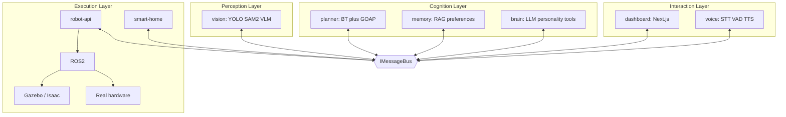

# Aria Architecture

Aria is a **distributed, plugin-based, local-first** software platform for a bilingual (Persian / English) humanoid home assistant. The robot is not one AI — it is a system of independent services behind stable ports.

## Principles

| Principle | How we enforce it |
|-----------|-------------------|
| Modularity | One service = one responsibility; packages map to future repos |
| Replaceability | Every model/hardware driver sits behind a port + plugin adapter |
| Clean / Hexagonal | Domain logic depends inward on interfaces; adapters at edges |
| SOLID + DI | Constructor injection; composition roots only wire concretes |
| Event-driven | Services talk only via `IMessageBus` + the event catalog |
| Local-first | Inference on-device; cloud adapters optional and off by default |
| Safety | Brain never controls motors; `robot-api` + safety monitor own actuators |
| Offline | Graceful degradation ladder down to safe stop |

## Topology



## Package map

| Path | Role |
|------|------|
| [`packages/contracts`](../packages/contracts) | Ports, Zod schemas, event catalog (**sacred**) |
| [`packages/core`](../packages/core) | DI, bus adapters, config, logging, plugin registry |
| [`apps/brain`](../apps/brain) | LLM orchestration, personality, tool calling |
| [`apps/voice`](../apps/voice) | Voice pipeline orchestration |
| [`apps/memory`](../apps/memory) | ChromaDB / RAG / preferences |
| [`apps/vision`](../apps/vision) | Perception + world model |
| [`apps/planner`](../apps/planner) | Goals → action graphs |
| [`apps/smart-home`](../apps/smart-home) | HA / MQTT / Matter skills |
| [`apps/robot-api`](../apps/robot-api) | Skills, safety, ROS2 bridge |
| [`apps/dashboard`](../apps/dashboard) | Operator UI |
| [`sdk`](../sdk) | Public TS client |
| [`sim`](../sim) | Gazebo / Isaac assets |
| [`sidecars`](../sidecars) | Python inference only |

**Dependency rule:** apps import `@aria/contracts` and `@aria/core` only — never sibling apps.

## Ports (replaceable surfaces)

Defined in `@aria/contracts`:

- `ILLMProvider` — Qwen / Ollama / mock / cloud
- `ISTTProvider` — Faster-Whisper / alternatives
- `ITTSProvider` — Piper / alternatives
- `IVisionProvider` — YOLO+SAM2+VLM facade
- `IMemoryStore` — ChromaDB / alternatives
- `IMessageBus` — in-process / NATS
- `IRobotSkill` — sim or real skill implementations

Swapping a model = new adapter + config change. Application services do not change.

## Pipelines

### Voice

Microphone → VAD → STT → `conversation.user_utterance` → Brain (+ Memory) → optional Goal → Planner → Tools → `conversation.assistant_reply` → TTS → Speaker

Target: < 2 s round trip. Persian and English auto-detected.

### Vision

Camera → Detection → Segmentation → Tracking → VLM → `vision.scene_updated` → Planner / Brain

### Action

`goal.created` → Planner (GOAP decompose + BT execute) → `IRobotSkill` → robot-api → ROS2 → Gazebo **or** real robot

The planner cannot tell sim from metal.

## Planner stance

Behavior Trees for execution; GOAP-style decomposition for goal assembly; FSMs only inside low-level skills. Details: [ADR-0003](adrs/0003-planner-bt-goap-hybrid.md).

## Language split

- **TypeScript**: brain, planning, memory orchestration, personality, smart home, API, dashboard, SDK
- **Python**: thin inference sidecars only (no business logic)

## Configuration

Environment variables select adapters (see `.env.example`):

```bash
ARIA_LLM_PROVIDER=mock   # mock | echo | ollama
ARIA_BUS=inprocess       # inprocess | nats
ARIA_ENV=dev             # dev | sim | robot
```

## Related ADRs

- [0001 Monorepo-first](adrs/0001-monorepo-first.md)
- [0002 Message bus](adrs/0002-message-bus.md)
- [0003 Planner hybrid](adrs/0003-planner-bt-goap-hybrid.md)
- [0004 Quantization / RTX 4060](adrs/0004-model-quantization-rtx4060.md)
